# Enriching a database through web scraping and API
#### Mayara Souza
&nbsp;

Food prices vary constantly year after year, but **is there a relationship between their nutritional values - more specifically, their calories - and how much they vary in a certain period of time? What about the correlation between food prices variation and the variation in minimum wage? Do they normally go hand in hand?**  

This analysis tries to answer these questions by using data from Turkey as its subject. 

The analytical process can be separated in the following parts:

1. The use of a dataset from Kaggle called global_prices that registers the price variation for different products in 76 countries from 2002 to 2021;  
&nbsp; 

2. Web scraping from a specific website (https://countryeconomy.com/national-minimum-wage/turkey) with the objective of getting a dataframe displaying the minimum wage variation in Turkey out of the table below;
   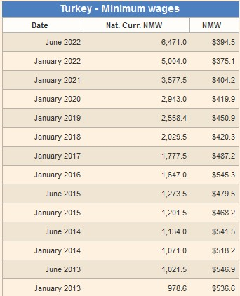

3. Merging these two dataframes in order to manipulate and analyse the data; 
   &nbsp;
4. Use of an API (https://rapidapi.com/hefesto-technologies-hefesto-technologies-default/api/food-nutrition-information/) that gathers the nutritional information of hundreds of different products. The objective was to look for a correlation between caloric value and price variation;
   &nbsp;
5. Visualizations and observations. 
&nbsp; 

### Parts 1, 2 and 3

At first, the global_prices dataset looked like this:
&nbsp; 
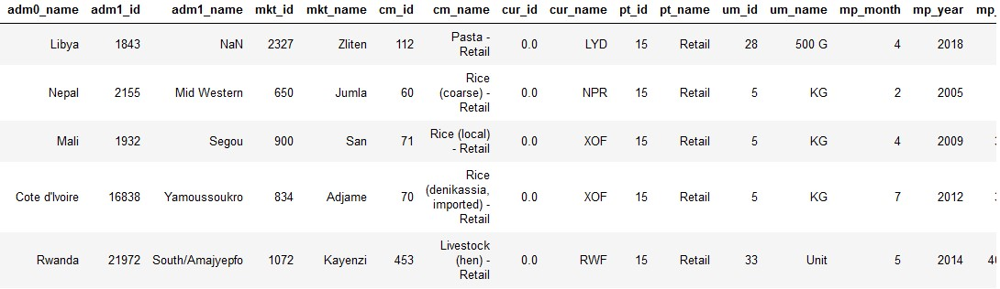

And the minimum wage over the years - after being scraped - looked like this:
&nbsp; 
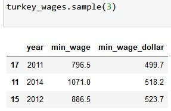

After merging the two dataframes and cleaning the columns so they would make more sense for this analysis, this was the result:
&nbsp; 
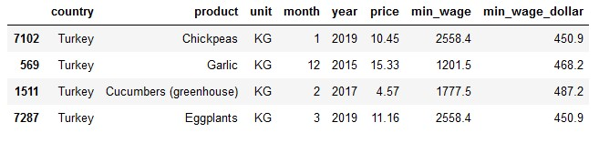
Here, we only have the price variation data for Turkey along with its minimum wage variation, everything categorized by years (2015 to 2021).

&nbsp; 
The next step was to focus on the total price variation for each product in the period of 2015 to 2021. For this, I created a different subset where the products had the percentual variation in this period:
&nbsp; 
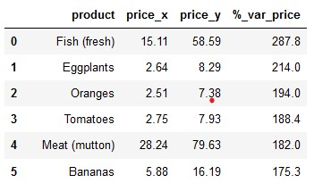

From there, it was a matter of creating two more subsets to register the top 10 foods that most varied in price and the bottom 10 ones.

### Part 4 - API

Having the list of foods that would be the analysed (top 10 and bottom 10), I passed them through the API in order to get their unique ID. For each ID, I made a new request to the API to get the nutritional information for each product. I focused on calories, sugar and fats, but in order to simplify the analysis - since I am not a dietitian - I used only calories for reference in the graphs.
&nbsp;
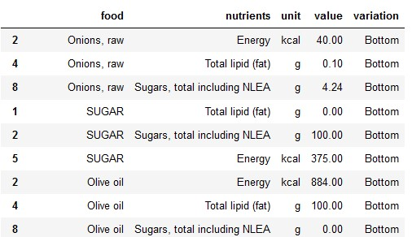

### Part 5 - Viz and observations

##### Graph 1: How much did the top 10 and bottom 10 foods varied in price compared with the minimum wage variation?

In order to plot these graphs:  

- I used the subset 'food_salary_variation_top' which takes the 10 products that most varied in price between 2015 and 2021, their percentual variation and the variation of minimum wage in the same period (a single value).  

- I used the subset 'food_salary_variation_bottom' that takes the 10 products that least varied in price between 2015 and 2021, their percentual variation and the variation of minimum wage in the same period (a single value).
  
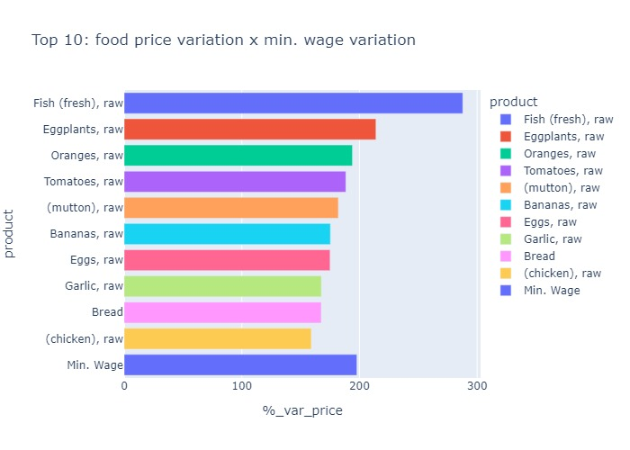

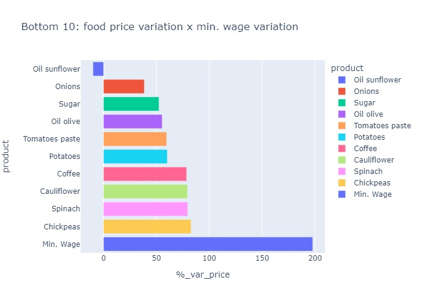

**Observations:**

- Only 2 products had a higher percentual variation than the minimum wage: eggplants and fish. These are two foods usually considered to be healthy.

- Among the products that least varied in price are sunflower oil (with a negative variation) and sugar, both normally seen as being harmful to our health (if eaten in excess).

##### Graph 3:  What's the relationship between food price variation and minimum wage variation like?

In order to plot these graphs:

- I used the 'food_wage_2' subset that takes into consideration how much of the minimum wage each food represents (in percentage) throughout the years.

- In opposition to the previous graphs, only the 6 top and bottom products were plotted. Otherwise there would have been too much noise in it.

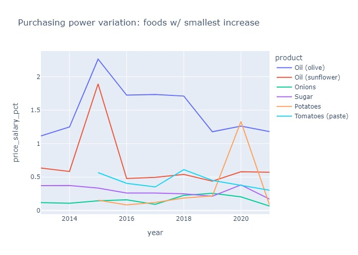

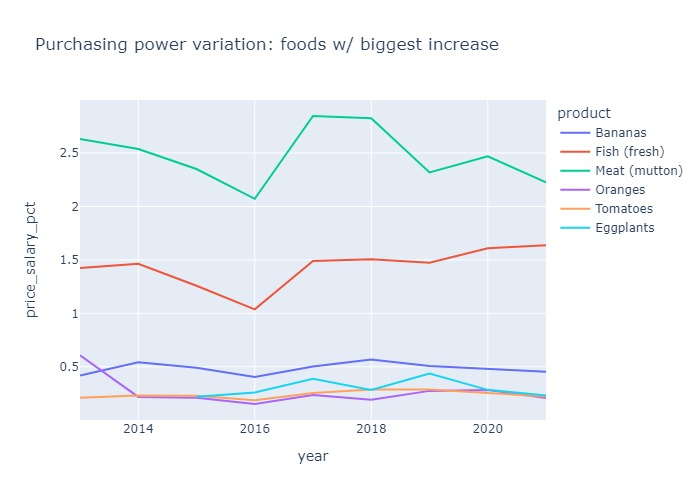

**Observations:**

- Meat and fish had large variations of price and also represent a significant portion of the minimum wage.

- Although sunflower oil had the smallest price variation of all the products, it represents a large part of the minimum wage when compared to the rest.

##### Graph 5: Do less caloric foods vary more or less in price?

In order to plot this graph: 

- First I assigned 'labels' ('top' and 'bottom') to differentiate on the graph the foods that varied more and less in price between 2015 and 2021;

- Then, I concatenated the two dataframes that had the nutritional information of the top 10 and bottom 10 foods (in terms of price variation). For the purposes of this analysis, I only took into consideration the calories per serving (assumes: 100g) of each food. A more thorough analysis would also take into consideration other nutritional aspects;  

- Finally, I plotted the bar graph that displays the calories of each food and if it is part of the top 10 or bottom 10 group.

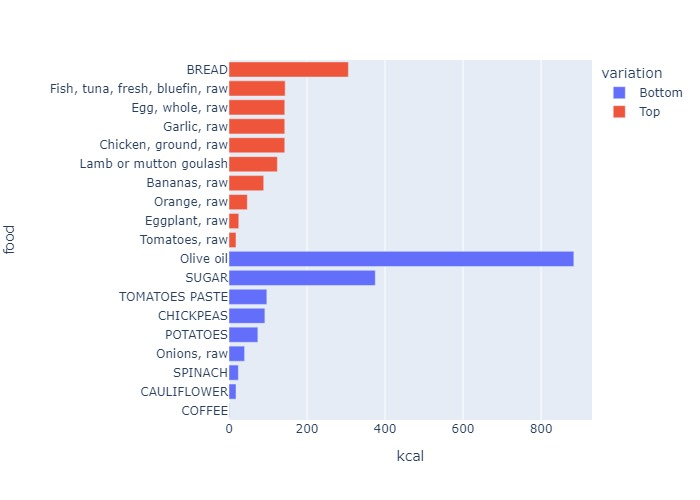

**Observations:**

- The relationship between calories and variation in price is not conclusive. Some less caloric foods (usually read as 'healthy', such as vegetables and fish) seem to variate more in price than the more caloric ones (such as oil and sugar). This could implicate in a difficulty of access to healthier foods in lower classes. However, this correlation is not true for all foods and, therefore, it is not possible to conclude that it exists.  
- The data did not have a big enough variety of healthy/unhealthy products either. Therefore, in order to conduct a precise analysis we would need price variation for different foods - specially processed and ultra processed ones.

- A better way to visualize this relationship would be by comparing the calories and the price variation on the same graph.
